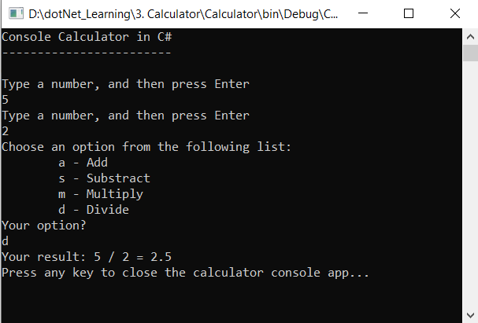
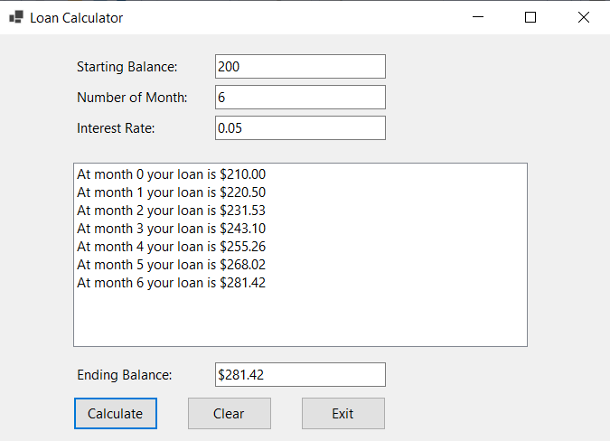
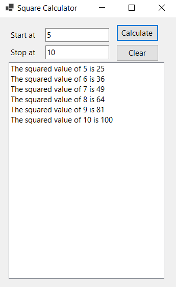

# Simple-Apps
practice with C# and .Net

# #1 Temperature Convertor

Build an app to convert temperature, using C#, web form in .Net.

# #2 Add friend to a list

Using the windows form in .Net, users can add a friend's name, sort the list with ascending or descending order, and clear all contents in the list.

# #3. Calculator console application

# #4. Loan Calculator

# #5. Square Calculator 

Input the start number and stop number, then the calculator will return a list of squared values.
With clear button, users can begin a new turn.

